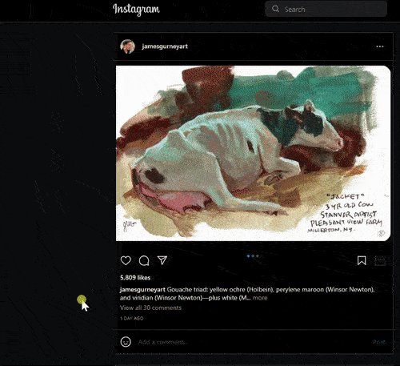
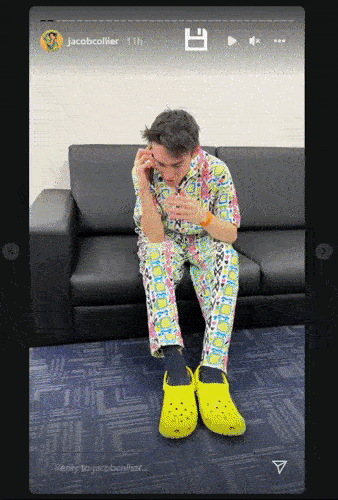
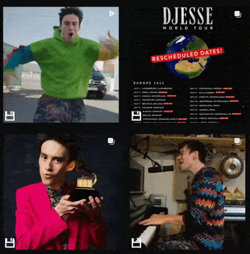
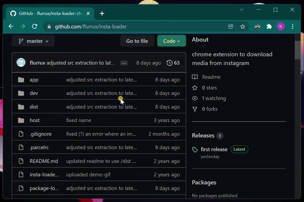
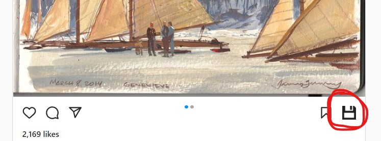
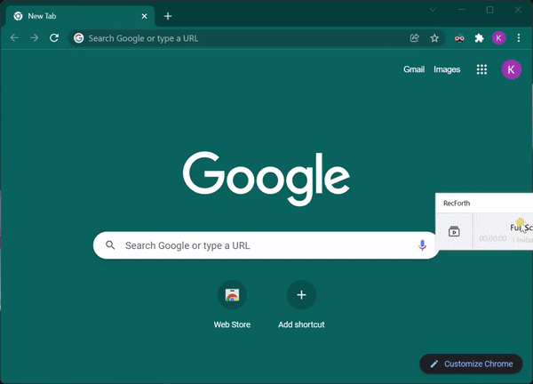

# about  

a chrome extension to quickly download any media from [https://instagram.com/](instagram.com)  

this extension breaks occasionally (once every couple of months) due to Instagram updating their website. i do my best to repair it asap whenever that happens. 

previous breakage was on October 11th 2022, when download-buttons in stories were missing sometimes and other times the story just failed to download. should be fixed now. 

## current minor bugs are:  

- audio is missing from downloaded videos. the reason is that video- and audio parts on instagram are stored in separate files on their servers. when you press download, only the video-part is downloaded. merging the parts into one mp4-file is possible, but the code required will bloat this extension immensely (~20 megabytes). an alternative is to simply download both video and audio together. will have to think more about this.

- video downloads sometimes fail due to a [limitation of chrome extensions to keep background scripts running](https://github.com/flurrux/insta-loader/issues/24#issuecomment-1159406256).  
if that's the case, please refresh the page and try again.  
if it still doesn't work, consider leaving [a bug report here](https://github.com/flurrux/insta-loader/issues?q=is%3Aissue+is%3Aopen+sort%3Aupdated-desc).  

&nbsp;

# features  

- download-buttons on mainfeed, stories and post pages  
- on the mainfeed or in stories, the enter-key can be pressed to trigger downloads

currently broken: 

- jump to lower/upper post on the mainfeed by `w` (upper post) or `s` (lower post)  
- navigate left/right on carousels (with multiple pictures/videos) and in stories via the `d` (navigate right) and `a` (navigate left) keys.  

downloaded videos/images will be saved in `Downloads/[username]`.  
so for example if you download an image from [instagram.com/beeple_crap](https://www.instagram.com/beeple_crap/), it will be placed in `Downloads/beeple_crap/`

### download from main-feed:  

### download from stories:  

### download from userpage:  

(longer gifs are intentionally choppy to reduce filesize)

# install

- click on the latest release to the right of this page and download the zip folder. it will be named something like `insta-loader-vx.x.x.zip`

- extract this zip folder in your Downloads folder or anywhere else.

- go to [chrome://extensions/](chrome://extensions/)

- make sure developer mode is enabled

- click "load unpacked"

- pick the extracted folder
  
- now when you visit [https://instagram.com/](instagram.com), you should see downlad buttons on every post like so:  

# uninstall

find this extension on [chrome://extensions/](chrome://extensions/), then click "Remove"